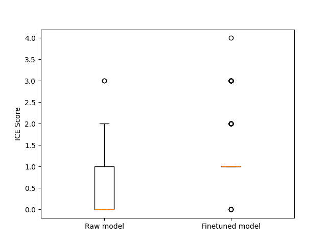
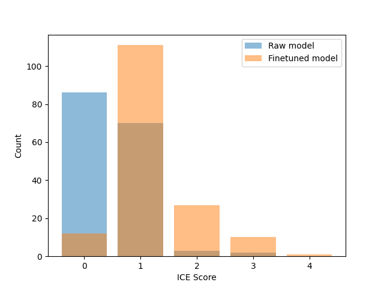

# kotlin-code-completion

## How to run

In order to run the project, you should use `python 3.10` and install packages specified in `requirements.txt`. I use openai api to translate dataset, and also to compute the ICE Score, so you also have to add `OPENAI_API_KEY = <your key>` to the `.env` file. The translation could be performed by running ```python translate.py```. The finetuning and evaluation is shown in the ```finetune_and_evaluate.ipynb```, which could be run from top to bottom (however, it would be more convenient to skip the hyperparameter validation part, because it takes significant time).

## Translation

To translate the dataset, I used openai api, and specifically *gpt-4o-mini* model to translate code exercises samples to Kotlin. You can find corresponding code, including the prompt, in the ```translate.py```. You can perform the translation by running ```python translate.py```. It translate first $n$ samples of code exercises dataset. The default value of $n$ is 10000, but you can adjust it in the ```translate.py``` if needed.

### Filtration and prompt engineering

The translation is far from perfect, with some errors while parsing the responses, and some errors in translation.

One direction of work is to improve the prompt, based on manual checks translation issues. I believe, this approach might improve the quality of generated translations, but it also requires significant time to find a good prompt. It is also be a good idea to consider other models: bigger models like *gpt-4o*, code translation models, etc.

Another possible approach is to filter out bad translation. To do so, I need to use a scoring method to rank the translations accept only those passing some score threshold. I see two possible scoring mechanisms (most probably, there are more of them).

* The first approach is based on test passing. Since the code exercises samples contain simple examples of input - output pairs, it is possible to ask a language model to construct corresponding tests. After that, the score will be something like **n_tests_passed**, **percentage_tests_passed**, or something similar. A problem with this approach is that it is very discrete, since the number of tests is small. It also will give a bad result for *almost* correct translation, but could also give a good score for an incorrect translation overfitted to the test cases.

* The second approach is based on LLM-scoring. Similarly to such metrics in code generation task like **ice-score**, I believe it is possible to use a prompt to an LLM, so that it will rate the translation. Such metric has a potential to imitate human judgement more precisely then most of other possible metrics.

## Finetuning

I decided to finetune codegen-350M-mono. After I translated training dataset, I split it into train and validation, so that I can monitor generalization. I ran validation with different values of `effective_batch_size` and `learning_rate`, and got the lowest validation loss for `effective_batch_size = 16` and `learning_rate = 1e-5`. I then ran the finetuning with such optimal hyperparameters.

## Evaluation

### Metrics

For the evaluation I chose the following metrics:

* **BLEU score**: that is a standard metric to evaluate LLMs. I included it because it is a very popular metric, however, it actually very poorly correlates with actual generation quality, as shown in many research papers, and also can be seen from the results below.
* **ChrF Score**: ChrF is another evaluation metric that is commonly used in the assessment of language models, particularly for machine translation tasks. Unlike BLEU, which is based on exact word or n-gram matches, ChrF calculates similarity based on character-level n-grams. [It is shown](https://arxiv.org/pdf/2208.03133) to be one of the best choices for generation quality evaluation.
* **ICE score**: The ICE score is a newer metric designed to evaluate language generation by leveraging modern LLMs. The core idea of ICE score is accurate prompting to an LLM, asking to grade the solution based on the problem and possibly based on the reference solution as well. Although it might be less interpretable, it has a potential to be closer to how a human would evaluate, than other metrics, since LLMs could produce non-trivial reasoning process. To evaluate this metric, I used the code from the following [repo](https://github.com/terryyz/ice-score).

### Evaluation results

Here are the results of the evaluation for the pre-trained codegen-350M-mono (raw model) and fo the finetuned codegen-350M-mono (finetuned model):

| Metric            | Raw Model | Fine-tuned Model |
|-------------------|-----------|------------------|
| Symbol-BLEU Score | 1.716e-05 | 1.513e-05        |
| ChrF Score        | 18.36     | 24.85            |
| ICE Score         | 0.609     | 1.230            |

Finetuned model shows better **ChrF Score** and **ICE Score** than the raw model, siggesting that the finetuning improved model's performance in Kotlin code generation task. The **BLEU score** is extremely low for both models, which emphasizes that it is not relevant for evaluation of code generation.

### Statistical analysis

In [this](https://arxiv.org/pdf/2208.03133) paper authors discuss that statistical assessments and more detailed results could give better understanding of the comparison than just computing the average metrics. I decided to analyse ICE Scores from this perspective. First, I draw the distribution of the scores:




These graphs show that the finetuned model, unlike the raw model, rarely produces complete garbage, and is much more often capable of generating a meaningful code. However, the finetuned model still rarely generates good-quality code, it is just a bit improved compared to the raw model.

I also perform a t-test to compare averate **ICE Score** for the raw model ($\mu_1$) and the average **ICE Score** for finetuned model ($\mu_2$). The null-hypotesis is $\mu_1 \ge \mu_2$, and the alternative is $\mu_1 < \mu_2$. The t-test shows `p-value = 2e-20`, suggesting that $\mu_1$ is indeed lower than $\mu_2$, meaning that the finetuned model outperforms the raw model based on the **ICE Score**.
